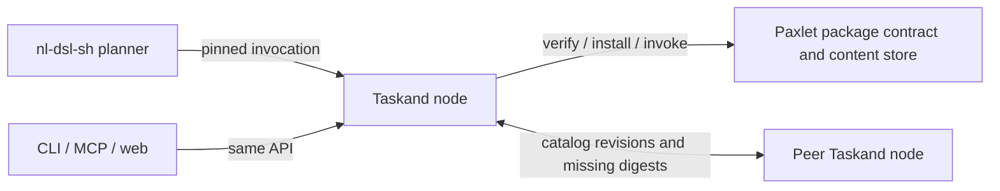

# Paxlet, Taskand and LAN synchronization

Assessment date: 2026-09-24. This slice implements Paxlet addressing, verified
content storage and isolated Taskand export. The user subsequently confirmed that the entire ecosystem is in
development and permits deeper, breaking architectural changes. The target below
supersedes the earlier compatibility-first migration recommendation. Observed
implementation and the proposed target remain distinct; LAN replication and the
Taskand architecture replacement are not implemented by this Paxlet slice.

## Observed ecosystem

Taskand was inspected at commit
[`1046dbd`](https://github.com/paxlet-com/taskand/tree/1046dbdabad3fd857aa33291474f4a546dd16009).
During continuation Taskand independently advanced to
[`41268dd`](https://github.com/paxlet-com/taskand/tree/41268dd4bd7407ba55c75bb64c0074c9f2a4aabb),
merging ticket-050's background gossip service. The shell consumer, federation
installer and package hash modules did not change between these heads; consumer
checks below bind the later head. The local `nl-dsl-sh` source is not a Git checkout; inspected
`src/nl_dsl_sh/interop.py` SHA-256 is
`4f2f5196e0d1fb1ccaa99afcf24f0ecf5e14928a50fb08e51aa449f55fd948cc`.

| Boundary | Evidence and consequence |
|---|---|
| Taskand catalog and pull | `generated/registry/core/taskand.dev/v1/federation.mjs` exports active entries, compares advertised/payload hashes, rejects same-URI content conflicts and registers imports as candidates. These are useful primitives to retain. |
| Peer visualization | `gateway/handlers/mesh.py` still reports configured peers as `UNOBSERVED`; the new `gateway/gossip.py` performs separate background probes and peer exchange. These projections need one node catalog instead of divergent observation state. |
| Process addressing | `generated/registry/core/taskand.dev/v1/store.mjs` accepts only `proc://taskand.dev/<organism>/<capability>/vN` and derives a package directory from that URI. Endpoint address, node identity and process identity need separate records. |
| Node identity | The same `store.mjs` uses `TASKAND_NODE` or hostname as `NODE_ID`. That is a label, not a verified durable cryptographic identity. Paxlet receipt node strings also do not establish authenticated identity. |
| Package hash | Taskand's `package.mjs` hashes sorted direct files with NUL delimiters. Paxlet includes the manifest and recursive package closure with length framing. Both use SHA-256 but produce different digests. Adding `paxlet.json` to a live Taskand package invalidates its existing hash. |
| Install boundary | Federation writes directly into the final directory before verifying, then deletes on failure. Directory existence checks and registration are separate from installation. Interrupted and concurrent imports need a staging/commit boundary. |
| Mutable control state | `store.mjs` already locks and atomically renames organism registries. Preserve that protection. Peer/genome writes have a separate path. `lifecycle.mjs` permits refresh of builtin hashes; that local development operation must not become a distributed immutable-version overwrite. |
| Export from nl-dsl-sh | `interop.py::export_paxlet` exports a compiled Python wrapper, resources, explicit permissions and `run`; it currently has no Paxlet action-URI planning adapter. Its wrapper returns `{exit_code, stdout, stderr}`. |
| Permissions and portability | Paxlet's reference runtime does not enforce filesystem/network declarations. Taskand's adapter uses generic object schemas and detects Node/Python/shell entry points; validation alone does not prove a process can run outside Taskand's environment. |

## New Taskand gossip boundary (ticket-050)

The new gateway worker is enabled by `TASKAND_GOSSIP_ENABLED` or nonempty
`TASKAND_PEERS`. It periodically probes health, exchanges peers, discovers missing
process URIs and calls the existing federation importer. This is real orchestration
code, but it still uses the old package/storage contract. Read-only inspection and
mocked probes at `41268dd` found concrete follow-up work:

- `TASKAND_GOSSIP_AUTO_APPROVE` defaults to true. Pulling candidate bytes can thus
  be followed by `approve`. Separate replication from local activation; require
  explicit local policy for any automatic approval.
- `_http_get_json` attaches the same bearer credential to health, gossip and
  catalog requests, including peers learned from another peer. Separate local
  administration from peer credentials, bind credentials to approved endpoints,
  and validate endpoint/redirect scope before sending them.
- HTTP JSON reads have no body bound, learned peers are appended to the list being
  traversed, and there is no bounded per-round peer budget. Validate response
  shape/size and process new discoveries in a later bounded round.
- An already-active URI is skipped even when the advertised digest changes.
  Detect that conflict explicitly. There are no persistent origin revisions or
  removal markers here; missing-only polling does not provide withdrawal or
  offline/rejoin convergence.
- `handle_gossip_trigger` calls `sync_once` without the per-action administrator
  grant used by `handle_registry` for `pull`/`approve`. Gateway POST authentication
  is present, but the trigger needs equivalent operation authorization.
- Background and explicit HTTP-triggered rounds can overlap. Serialize a round
  and retain the immutable-store publication boundary independently of that lock.

Mocked probes confirmed default auto-approval, credential attachment, an unbounded
response read and skipping a same-URI/different-digest advertisement. They made no
network requests or registry mutations. The follow-up should adapt this existing
worker rather than create another synchronization daemon. Its current unit tests
use mocked peers; they do not establish multi-node convergence.

## What now works in Paxlet

The environment registry explicitly binds package aliases to URNs. Action URI
resolution verifies manifest identity/version, alias declaration, action and
package digest before returning a portable selection. Moving an installed package
changes a registry location, not its manifest. Execution rechecks the selected
digest and preserves it in the receipt. `resolve`/`inspect` do not execute code.

Taskand export copies packages into a new directory. It does not modify, activate
or grant access to the source process. A `proc://` alias denotes the copied package;
`run` remains explicit. A future Taskand gateway adapter must apply the existing
caller grants before any remote invocation. Calling the local Paxlet runtime
is not equivalent to passing through that gateway.

## Accepted direction for the development architecture

Optimize for one comprehensible system. Existing proc URI syntax, proc.yaml
manifests, per-organism registry files and duplicate digest formats may be replaced.
A temporary importer may read old data, but maintaining two runtime representations
is not a design requirement. This permission changes the migration constraints;
it does not imply that a particular replacement is already implemented.

| Owner | Target responsibility | Duplication to remove |
|---|---|---|
| Paxlet | Package manifest, action contracts, canonical package digest and verified immutable content store | Separate Taskand package format/hash and repeated package validation |
| Taskand | Node identity, one local transactional catalog, execution policy, scheduling, peer discovery and replication | Per-organism registry writers and separate CLI/MCP/mesh catalogs |
| nl-dsl-sh | Construct/compile a plan whose callable steps use the shared invocation contract | Parallel package-resolution rules or executable URIs inferred by an LLM |
| CLI, MCP and web | Present or submit the same catalog queries and authorized invocation requests | Independent routing, alias interpretation and execution policies |

The canonical package remains a named, versioned content object. An action is a
member of its manifest. `paxlet://…/actions/…` is a human-facing selector; the
persisted execution request contains `package`, `action`, `version`, `digest` and
`input`. It contains no machine-specific installation path. Every executable plan
must be bound to exact package bytes before submission. Availability and grants
are evaluated by the destination node, not inferred from discoverability.



## Concrete simplifications

1. **One package representation.** Use `paxlet.json` for executable actions,
   input/output contracts and package dependencies. Taskand-specific metadata
   extends that manifest where necessary; it must not repeat fields under a second
   semantic definition. Convert existing generated processes in isolated staging,
   update their consumers in the same cutover and stop writing `proc.yaml` in the
   new flow. Historical receipts retain their original schema and digest meaning.
   New transfers and receipts use the Paxlet digest; never reinterpret an old
   Taskand hash as if it were computed by Paxlet.
2. **One immutable package store.** Separate package bytes from work directories,
   execution receipts, grants and credentials. Paxlet now copies the canonical
   inventory, validates bounded archive entries in private staging, atomically
   publishes complete digest-addressed objects and rechecks stored contents.
   It derives catalog records from manifests without a second mutable identity
   database. Conflicting claims may exist as candidate blobs, but ambiguous URN
   lookup fails; the Taskand catalog must reject conflicting active identity/version
   assignments. The shared golden digest vector passes independently in Python
   and Node, including non-ASCII/non-BMP paths and changed creation order.
   See the [implemented storage contract](addressing.md#verified-local-content-store).
3. **One local catalog per node.** Prefer a single SQLite-backed catalog owned by
   the Taskand node, with package/action records derived from verified manifests.
   Organisms become labels or namespace fields. CLI, gateway, MCP and mesh read
   projections of that same catalog. Package aliases and endpoint observations
   remain separate from immutable content. Keep local approval/grant state
   distinct from replicated catalog declarations. A discovered alias is a claim;
   the authorized namespace owner decides whether it enters the local index.
   SQLite's transaction provides the catalog commit boundary
   ([atomic commit](https://www.sqlite.org/atomiccommit.html)); it does not make
   a filesystem rename and a database update one transaction. Install verified
   immutable bytes first, then commit their catalog reference. Recovery can retain
   an unreferenced blob, but must never expose a runnable record with missing or
   unverified content.
4. **A small synchronization protocol.** Begin with configured seed peers and
   bounded polling. Exchange a versioned catalog snapshot carrying origin,
   revision and digest; fetch only missing package digests. Retain removal markers
   and the last accepted origin revision so old peers cannot resurrect withdrawn
   entries. Use one writer per namespace initially; reject competing claims
   instead of merging executable definitions by last-write-wins. Replicate logical
   catalog records and immutable objects, never the live database file, secrets,
   grants, locks or execution queues. Add delta transport and automatic discovery
   only when measured needs justify them.
5. **Node identity independent of addresses.** Give each node a persisted identity;
   hostname/IP/port and last-seen time are mutable observations. Treat discovery as
   finding candidate endpoints. Define peer authentication and namespace authority
   independently, and validate endpoints, redirects, schemas, response sizes and
   timeouts at the transport boundary. Packages do not need their own servers.
6. **One explicit invocation boundary.** Plans, catalog queries and package
   synchronization do not execute code. Taskand binds a caller-scoped invocation
   ID to action, package digest and input digest, then applies local grants and
   records the result. Unknown outcomes are reconciled before retrying side
   effects. Do not propagate grants merely because a peer advertised a process.
   When URI spelling changes, migrate grants by reviewed action identity; a string
   rewrite must not accidentally broaden execution permissions.

For the development cutover, rebuild generated indexes from the new package set
and update internal callers and tests together. Retaining old endpoint spelling
is optional. Prefer removing obsolete adapters after the replacement passes its
contract tests over keeping an indefinite compatibility branch in each component.
Keep existing data and execution evidence available until the new representation
has been verified; regeneration is not an implicit deletion operation.

## Ordered implementation slices

| Slice | Bounded change | Required evidence |
|---|---|---|
| Paxlet groundwork (implemented) | Explicit aliases/actions, digest pins, copy-based export | URN/URI equivalence, malformed selectors, fallback, conflicts, relocation and non-execution tests |
| Shared package/storage contract (implemented) | Atomic verified Paxlet objects, no mutable store identity index, manifest-derived catalog records and explicit execution copies | Directory/archive equality; Python/Node golden vector; hostile archives, corruption, interrupted/concurrent import; actual Taskand shell export/store/materialize/run roundtrip |
| Taskand catalog cutover | One transactional node catalog and one invocation model; update gateway/MCP/CLI consumers; replace duplicate registry/hash code | All surfaces see the same actions and versions; planning cannot execute; grants retain their intended action scope |
| Taskand replication | Stage, verify, atomically install and register remote candidates using the common package format | Two isolated nodes; interrupted transfer, concurrent import, malicious paths, idempotent retry and same-version conflict |
| Taskand LAN sync | Seed configuration, catalog revisions and peer liveness; discovery optional | Three nodes; offline/rejoin, stale snapshot, withdrawn entry, untrusted peer and convergent inventories without automatic activation |
| nl-dsl-sh integration | Emit and consume the common pinned invocation structure; update development fixtures directly | Alias remapping cannot change saved execution intent; native runtime alternatives preserve the action contract |
| Remote execution reconciliation | Single Taskand authorization/result boundary across transports | Timeout after acceptance does not cause blind duplicate execution |

Source changes in each repository need their own bounded ticket and owner. The
existing Paxlet ticket is retained; PLF-003 carries this revised target and replaces
its earlier promise of permanent proc URI compatibility. Taskand's current
`app/shell_workflow.py`, `packages/taskand-shell/`, native shell URIs and gateway/MCP
integration are existing consumers to migrate, not features to reinvent.

The two-node and three-node checks remain required before claiming LAN convergence.
Breaking-change permission allows a simpler implementation; it does not substitute
for those integration results. The exact catalog schema, wire format and runtime
sandbox must be settled in the owning implementation slice before they are exposed.

## Validation and reproduction

```sh
PYTHONPATH=/path/to/nl-dsl-sh/src TASKAND_ROOT=/path/to/taskand python3 -m unittest discover -s tests -v
python3 conformance/run.py
make verify-examples

# Bash/Python/PowerShell contract tests, with no network access during the run.
docker build -f tests/docker/Dockerfile -t paxlet-interop .
docker run --rm --network none --read-only --tmpfs /tmp:rw,mode=1777 \
  --mount type=bind,src="$PWD",dst=/workspace,readonly paxlet-interop
```

The host adapter check validated all 38 processes in the inspected Taskand
`generated/` tree without writing to it. A controlled exported Node fixture
executed through the explicit registry alias with digest-bound receipt. This
establishes the adapter boundary, not portability of all 38 production processes.

An actual local nl-dsl-sh plan containing a Bash step and a Python step was compiled,
exported to Paxlet, resolved by URN with a digest, and executed successfully. The
output was `Hello, Ada!` followed by `Python complete`. No Taskand process or
nl-dsl-sh source was modified. Bash and PowerShell alternatives share the same
JSON action contract in `tests/test_runtime_interop.py`; their runtime-specific
packages intentionally have different content digests.


The storage slice does not replace Taskand's active registry, hashing or federation
handlers. It provides their verified import/materialization boundary. The current
Taskand shell consumer passes both its own 14-test suite and a real
export → store → execution-copy → digest-pinned run test against this Paxlet tree.
No Taskand source or live catalog was modified. Reproduction of that optional
consumer test requires nl-dsl-sh installed, or its `src` on `PYTHONPATH`, alongside
an explicit `TASKAND_ROOT`. Linux Docker covers Bash, Python, PowerShell and Node;
native Windows and multi-node network convergence remain separate evidence.
